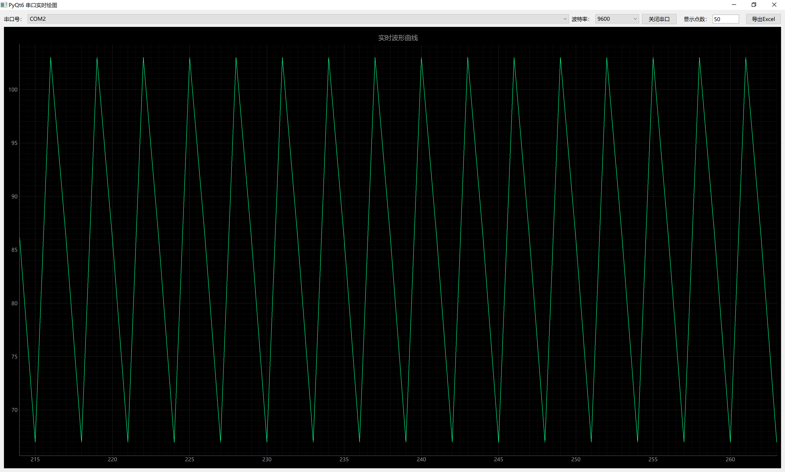

<p align="center"><strong>SerialCurve</strong></p>

<p align="center">
<a href="https://github.com/ihula/SerialCurve/releases"></a>
<a href="https://github.com/ihula/SerialCurve/stargazers"></a>
<a href="https://gitee.com/ihula/SerialCurve"></a>
<a href="https://github.com/ihula/SerialCurve/network/members"></a>
<a href="https://github.com/ihula/SerialCurve/blob/master/LICENSE"></a>


</p>

<p align="center">
语言：<a href="README-EN.md">English</a> / <strong>中文</strong>
</p>

基于Python的程序，实现跨平台多操作系统的串口16进制数据读写，以曲线显示，并可以导出数据到Excel

---
# Design Principles 设计原则

* 跨平台
* 简单易用
* 高效

# Platform 平台
   - Windows 
   ```
   # 进到项目根目录

   # 删除旧虚拟环境
   # macOS / Ubuntu
   rm -rf .venv
   # windows
   rm .venv -r -fo

   # 新建干净虚拟环境
   # macOS
   python3 -m venv .venv-macos
   # Ubuntu
   python3 -m venv .venv-ubuntu
   # windows
   python -m venv .venv-win

   # 激活虚拟环境
   # macOS
   source .venv-macos/bin/activate
   # Ubuntu
   source .venv-ubuntu/bin/activate
   # windows
   .venv-win\Scripts\activate

   #一键安装所有依赖
   pip install -r requirements.txt
   ```
   - Linux ( x86_64 )
   - macOS ( x86_64 )

SerialCurve已经在以下平台做过测试:

   - Windows ( x86_64 )
   - Linux ( x86_64 )
   - macOS ( x86_64 )
   - ...

# Todo List 待处理事项

## Strategic Goal 战略目标

- [x] 1.首先支持windows和linux平台
- [ ] 2.增加通用串口通信协议
- [ ] 3.支持热插拔
- [X] 4.全新的跨平台串口调试助手
- [ ] 5.串口侦听hook


# Last Modify 最新版本

## Version: 4.1.0.201010
by Hula on 2026-05-02

# Quick Start 快速开始

```
$ git clone --depth=1 https://github.com/ihula/SerialCurve.git
$ cd CSerialPort
$ mkdir bin && cd bin
$ cmake ..
$ cmake --build .
```

运行示例程序

# Screenshot 截图

## Gui 图形用户界面



# Contacting 联系方式

* Email : ihula123@outlook.com

# Links 链接

* [CSDN博客](https://blog.csdn.net/ihula123)
* [Github](https://github.com/ihula/SerialCurve)
* [Gitee码云](https://gitee.com/ihula/SerialCurve)

# Donate 捐助

[CSDN博客](https://blog.csdn.net/ihula123)

---
# Other branches 其他分支


---

# License 开源协议

自 V3.0.0.171216 版本后采用[GNU Lesser General Public License v3.0](LICENSE)